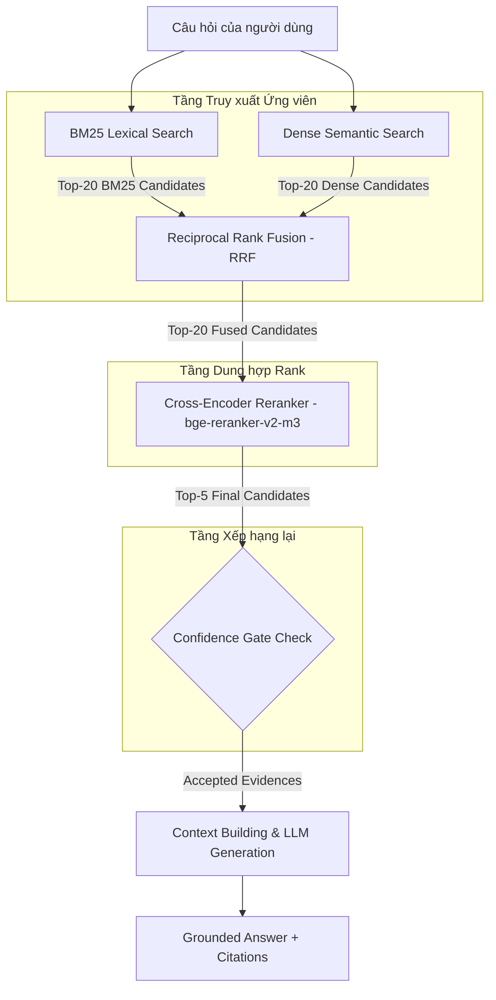

# BUỔI 08: ADVANCED RAG SYSTEM (HYBRID SEARCH, RRF FUSION & CROSS-ENCODER RERANKING)

## 1. Mục tiêu & Khác biệt giữa Buổi 07 và Buổi 08
- **Buổi 07 (Semantic RAG Baseline)**: Chỉ sử dụng mô hình Dense Semantic Retrieval (Gemini Embeddings + ChromaDB Cosine Distance). Hạn chế: Dễ bỏ sót các câu hỏi chứa chính xác từ khóa pháp lý, số Điều/Khoản hoặc mã hiệu thông tư.
- **Buổi 08 (Advanced Hybrid RAG)**: Tích hợp kiến trúc tìm kiếm đa tầng sản xuất:
  - **BM25 Lexical Retrieval**: Tìm kiếm từ khóa chính xác (số Điều/Khoản, thuật ngữ pháp lý chuyên ngành).
  - **Dense Semantic Retrieval**: Tìm kiếm ngữ nghĩa đa dạng với Gemini Embeddings (`gemini-embedding-2`).
  - **Reciprocal Rank Fusion (RRF)**: Dung hợp danh sách xếp hạng từ hai nhánh độc lập mà không cộng thô điểm số.
  - **Cross-Encoder Re-ranking**: Sử dụng mô hình `BAAI/bge-reranker-v2-m3` đánh giá lại mức độ liên quan ngữ nghĩa chi tiết giữa Cặp (Query, Candidate).

---

## 2. Sơ đồ Kiến trúc Pipeline


---

## 3. Cấu trúc Project
```
rag_foundation/buoi_08/
├── SPEC_buoi_08.md              # Specification & Data/Pipeline Contracts
├── README.md                    # Hướng dẫn tổng quan & cài đặt
├── requirements.txt             # Khai báo thư viện phụ thuộc trực tiếp
├── .env.example                 # Mẫu cấu hình môi trường
├── .gitignore                   # File loại trừ git
├── rag.py                       # Semantic RAG Baseline (Kế thừa từ Buổi 07)
├── advanced_rag.py              # Core Pipeline Advanced RAG (BM25 + Dense + RRF + Reranker)
├── evaluate.py                  # Mô-đun đánh giá chỉ số Benchmark (Recall, MRR, nDCG)
├── app.py                       # Streamlit UI Comparison Dashboard
├── eval/
│   └── questions.json           # Tập câu hỏi đánh giá mẫu (Starter Set)
├── tests/                       # Bộ kiểm thử Unittest (Offline 100%)
│   ├── __init__.py
│   ├── test_bm25.py
│   ├── test_semantic.py
│   ├── test_hybrid.py
│   ├── test_reranker.py
│   ├── test_answer.py
│   ├── test_evaluator.py
│   └── fixtures/
│       └── chunks_advanced_sample.json
├── reports/                     # Thư mục lưu báo cáo JSON benchmark
└── storage/                     # Thư mục chứa ChromaDB và HuggingFace cache cục bộ
    ├── chroma/
    └── huggingface/
```

---

## 4. Setup Môi trường `.venv`, Requirements & `.env`
1. Kích hoạt Virtual Environment của Buổi 05 (hoặc venv tương đương):
   ```powershell
   d:\OneDrive - Dai Nam University\Google DataAnalyst\Agribank\RAG\rag_foundation\buoi_05\.venv\Scripts\Activate.ps1
   ```
2. Cài đặt các thư viện phụ thuộc:
   ```bash
   pip install -r rag_foundation/buoi_08/requirements.txt
   ```
3. Khởi tạo file cấu hình `.env` từ `.env.example`:
   ```bash
   cp rag_foundation/buoi_08/.env.example rag_foundation/buoi_08/.env
   ```
4. Cập nhật `GEMINI_API_KEY` trong file `.env` với API Key hợp lệ của bạn.

---

## 5. Cảnh báo Kích thước & Tài nguyên Reranker Model
- Mô hình Cross-Encoder mặc định: `BAAI/bge-reranker-v2-m3`.
- Dung lượng tải xuống: **~1.1 GB** đến **~2.2 GB**.
- Yêu cầu tài nguyên:
  - Dung lượng ổ đĩa khả dụng $\ge 3$ GB.
  - RAM hệ thống khả dụng $\ge 4$ GB.
  - Khi chạy trên CPU, thời gian inference cho 20 cặp candidates mất khoảng $1.0 - 2.5$ giây.
- Mô hình áp dụng cơ chế **Lazy-Loading**: Không tải về đĩa hoặc nạp vào bộ nhớ RAM khi chưa chủ động chạy lệnh `rerank` hoặc `query`.

---

## 6. Hướng dẫn Lệnh CLI Thực thi

Chạy các lệnh bên dưới từ thư mục gốc `RAG`:

### A. Kiểm tra Trạng thái Hệ thống (Read-Only)
```bash
python rag_foundation/buoi_08/advanced_rag.py status --strategy hierarchical
```

### B. Chuẩn bị Semantic Index (Gọi Gemini Embedding thật & Upsert ChromaDB)
```bash
python rag_foundation/buoi_08/advanced_rag.py prepare-semantic --strategy hierarchical
```

### C. Truy xuất BM25 Lexical Search
```bash
python rag_foundation/buoi_08/advanced_rag.py bm25 --strategy hierarchical --question "Điều 7 quy định gì?"
```

### D. Truy xuất Hybrid Search (RRF Fusion)
```bash
python rag_foundation/buoi_08/advanced_rag.py hybrid --strategy hierarchical --question "Điều 7 quy định gì?"
```

### E. Truy xuất Cross-Encoder Rerank (Hỗ trợ nạp model thật)
```bash
python rag_foundation/buoi_08/advanced_rag.py rerank --strategy hierarchical --question "Điều 7 quy định gì?"
```

### F. Hỏi đáp Hoàn chỉnh (Grounded Answer & Citation Mapping)
```bash
python rag_foundation/buoi_08/advanced_rag.py query --mode hybrid_rerank --strategy hierarchical --question "Điều 7 quy định như thế nào về cơ cấu lại thời hạn trả nợ?"
```

### G. So sánh Trực diện 4 Retrieval Modes (Không gọi LLM Generation 4 lần)
```bash
python rag_foundation/buoi_08/advanced_rag.py compare --strategy hierarchical --question "Điều 7 quy định gì?"
```

---

## 7. Lệnh Chạy Unittest, Evaluation & Streamlit UI

### A. Chạy Toàn bộ 41 Unittests (Offline 100%)
```bash
python -m unittest discover -s rag_foundation/buoi_08/tests -p "test_*.py"
```

### B. Chạy Đánh giá Định lượng Benchmark
```bash
python rag_foundation/buoi_08/evaluate.py --strategy hierarchical --k 5
```

### C. Chạy Giao diện Streamlit UI Comparison Dashboard
```bash
streamlit run rag_foundation/buoi_08/app.py
```

---

## 8. Giải thích các Chỉ số Thang điểm (Scores)
1. **BM25 Score**: Điểm tần suất từ khóa Okapi BM25 ($[0, +\infty)$). Điểm cao thể hiện sự trùng khớp từ khóa chính xác.
2. **Cosine Distance**: Khoảng cách vector giữa query và document ($[0, 2.0]$). Giá trị càng nhỏ thể hiện mức độ tương đồng ngữ nghĩa càng cao.
3. **RRF Score**: Điểm dung hợp dựa trên thứ tự xếp hạng:
   $$\text{RRF\_Score} = \frac{W_{\text{bm25}}}{K_{\text{rrf}} + R_{\text{bm25}}} + \frac{W_{\text{semantic}}}{K_{\text{rrf}} + R_{\text{semantic}}}$$
4. **Rerank Score (Sigmoid)**: Điểm tương quan ngữ nghĩa chuyên sâu tính từ logit của mô hình Cross-Encoder:
   $$\text{Rerank\_Score} = \frac{1}{1 + e^{-\text{logit}}} \in [0.0, 1.0]$$

---

## 9. Phân biệt Candidate K và Final Top-K
- **`BM25_CANDIDATES` & `SEMANTIC_CANDIDATES`** (Mặc định `20`): Số lượng ứng viên thô ban đầu được lấy từ từng nhánh riêng biệt.
- **`RERANK_CANDIDATES`** (Mặc định `20`): Số lượng ứng viên tối đa sau hợp nhất RRF được đưa vào Cross-Encoder Reranker.
- **`FINAL_TOP_K`** (Mặc định `5`): Số lượng ứng viên xuất sắc nhất sau Rerank được lọc qua Confidence Gate để đưa vào ngữ cảnh cho LLM sinh câu trả lời.

---

## 10. Evaluation Metrics & Giới hạn của Starter Gold Labels
- Các chỉ số được đánh giá bao gồm: **Recall@K**, **MRR@K** (Mean Reciprocal Rank), **nDCG@K** (Normalized Discounted Cumulative Gain với binary relevance) và **Latency Mean/P50**.
- **Giới hạn dữ liệu**: Bộ câu hỏi trong `eval/questions.json` là tập dữ liệu thử nghiệm sơ bộ (Starter Set) mang cờ `"needs_human_review": true`. Các chỉ số chưa đại diện cho đánh giá của chuyên gia pháp lý và KHÔNG được dùng để tuyên bố chính thức mode chiến thắng trong sản xuất.

---

## 11. Xử lý Lỗi Phổ biến (Troubleshooting)
- **Lỗi không tải được Reranker Model**: Kiểm tra kết nối Internet. Có thể bật HuggingFace Mirror hoặc đặt `HF_HUB_ENABLE_HF_TRANSFER=1`.
- **Lỗi thiếu GEMINI_API_KEY**: Kiểm tra file `.env` tại thư mục Buổi 08 đã khai báo khóa API chưa.
- **Suy giảm hiệu năng trên CPU**: Điều chỉnh `RERANK_BATCH_SIZE=2` hoặc `RERANKER_MAX_LENGTH=256` trong `.env`.
- **Cảnh báo Symlinks trên Windows**: Có thể bỏ qua warning hoặc bật Developer Mode trên Windows để tăng tốc độ ghi đĩa.

---

## 12. Tuyên bố Tự miễn Trách nhiệm Pháp lý
*Hệ thống RAG này được thiết kế thuần túy cho mục đích nghiên cứu thử nghiệm và giảng dạy công nghệ Information Retrieval. Kết quả câu trả lời không thay thế cho văn bản luật chính thức và không cấu thành lời khuyên hay tư vấn pháp lý chính thức.*
